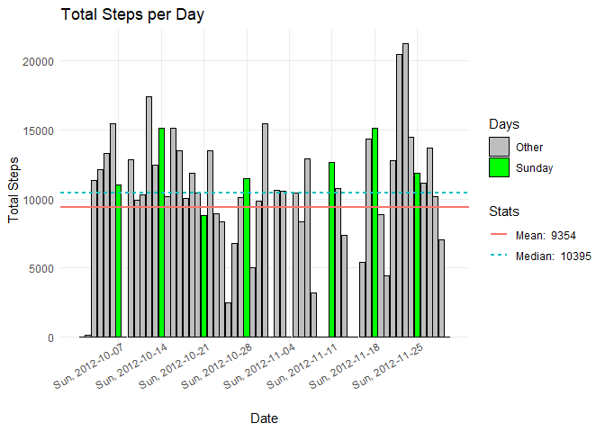
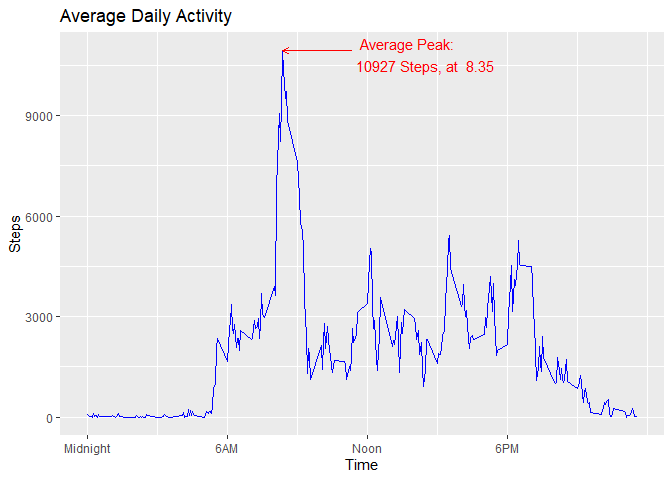
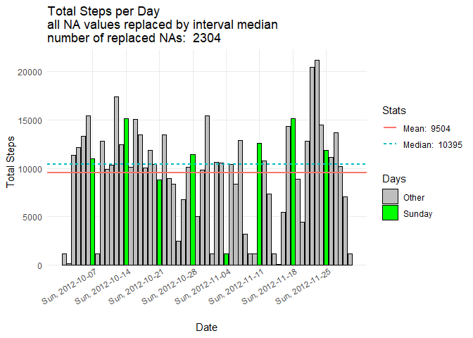
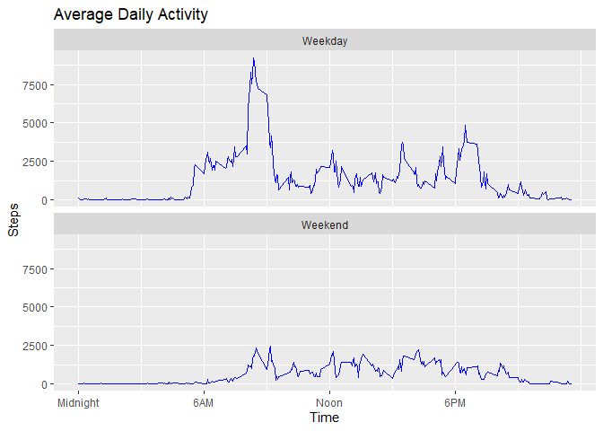

## Loading and preprocessing the data

``` r
library(dplyr)
```

```
## 
## Attaching package: 'dplyr'
```

```
## The following objects are masked from 'package:stats':
## 
##     filter, lag
```

```
## The following objects are masked from 'package:base':
## 
##     intersect, setdiff, setequal, union
```

``` r
library(lubridate)
```

```
## 
## Attaching package: 'lubridate'
```

```
## The following objects are masked from 'package:base':
## 
##     date, intersect, setdiff, union
```

``` r
df <- read.csv("./data/activity.csv")
df <- df %>%
  mutate(date = as.Date(date))
```

## What is mean total number of steps taken per day?

``` r
library(ggplot2)

# total steps per day
df_1 <- df %>%
  group_by(date) %>%
  summarize(steps = sum(steps, na.rm = TRUE))
mean_steps <- round(mean(df_1$steps))
median_steps <- median(df_1$steps)
line_data <- data.frame(
  yintercept = c(mean_steps, median_steps),
  Stats = c(paste("Mean: ", mean_steps), paste("Median: ", median_steps))
)

# additional steps for the histplot
df_2 <- df %>%
  group_by(date) %>%
  summarize(steps = sum(steps, rm.na=TRUE)) %>%
  mutate(steps = coalesce(steps, 0)) %>%
  mutate(is_monday = ifelse(wday(date, week_start = 7) == 1, "green", "gray"))

# names for the histplot x-axis
names <- df_2 %>%
  filter(is_monday == "green") %>%
  mutate(name = paste("Sun,", date)) %>%
  select(date, name)


ggplot(df_2, aes(x = date, y = steps, fill = is_monday)) + 
  geom_col(color = "black") +
  theme_minimal() +
  theme(axis.text.x = element_text(angle = 30, hjust = 1, vjust = 1.4), 
        panel.grid.minor = element_blank()) +
  scale_x_continuous(
    breaks = names$date,
    labels = names$name
  ) +
  labs(title = "Total Steps per Day", x = "Date", y = "Total Steps") +
  scale_fill_manual(values = c("gray", "green"), 
                    name = "Days", 
                    labels = c("Other", "Sunday")) +
  geom_hline(data = line_data, aes(yintercept = yintercept, color = Stats, linetype = Stats), size = .8)
```

```
## Warning: Using `size` aesthetic for lines was deprecated in ggplot2 3.4.0.
## ℹ Please use `linewidth` instead.
## This warning is displayed once every 8 hours.
## Call `lifecycle::last_lifecycle_warnings()` to see where this warning was
## generated.
```

<!-- -->


## What is the average daily activity pattern?

``` r
# create the time series data
df_timeseries <- df %>%
  filter(!is.na(steps)) %>%
  group_by(interval) %>%
  summarize(steps = sum(steps, na.rm = TRUE))

# find the maximum average interval
max_interval <- df_timeseries %>%
  filter(steps == max(steps))

# labels for the x-axis
timeseries_xaxis_names <- c("Midnight", "6AM", "Noon", "6PM")

# lineplot for the time series
ggplot(df_timeseries, aes(x = interval, y = steps)) +
  geom_line(color = "blue") + 
  labs(title = "Average Daily Activity", x = "Time", y = "Steps") +
  scale_x_continuous(
    breaks = c(0, 600, 1200, 1800),
    labels = timeseries_xaxis_names
  ) + 
  # adding the arrow to the peak
  geom_segment(
    x = max_interval$interval + 300, xend = max_interval$interval,
    y = max_interval$steps, yend = max_interval$steps,
    arrow = arrow(length = unit(0.2, "cm")),
    color = "red"
  ) +
  # adding the arrow text
  annotate(
    "text",
    x = max_interval$interval + 300, y = max_interval$steps - 100,
    label = paste("  Average Peak: \n", max_interval$steps, "Steps, at ", max_interval$interval/100),
    color = "red",
    size = 4,
    hjust = 0
  )
```

<!-- -->
## Imputing missing values
Strategy to impute NAs: Replace NAs with the median value.


``` r
na_count <- (sum(is.na(df$steps)))
df_filled <- df %>%
  group_by(interval) %>%
  mutate(steps = ifelse(is.na(steps), ifelse(median(steps, na.rm = TRUE) > 0, median(steps, na.rm = TRUE), 0)
, steps))

df_1 <- df_filled %>%
  group_by(date) %>%
  summarize(steps = sum(steps, na.rm = TRUE))
mean_steps <- round(mean(df_1$steps))
median_steps <- median(df_1$steps)
line_data <- data.frame(
  yintercept = c(mean_steps, median_steps),
  Stats = c(paste("Mean: ", mean_steps), paste("Median: ", median_steps))
)

# additional steps for the histplot
df_2 <- df_filled %>%
  group_by(date) %>%
  summarize(steps = sum(steps, rm.na=TRUE)) %>%
  mutate(steps = coalesce(steps, 0)) %>%
  mutate(is_monday = ifelse(wday(date, week_start = 7) == 1, "green", "gray"))

# names for the histplot x-axis
names <- df_2 %>%
  filter(is_monday == "green") %>%
  mutate(name = paste("Sun,", date)) %>%
  select(date, name)


ggplot(df_2, aes(x = date, y = steps, fill = is_monday)) + 
  geom_col(color = "black") +
  theme_minimal() +
  theme(axis.text.x = element_text(angle = 30, hjust = 1, vjust = 1.4), 
        panel.grid.minor = element_blank()) +
  scale_x_continuous(
    breaks = names$date,
    labels = names$name
  ) +
  labs(title = paste("Total Steps per Day\nall NA values replaced by interval median\nnumber of replaced NAs: ", na_count), x = "Date", y = "Total Steps") +
  scale_fill_manual(values = c("gray", "green"), 
                    name = "Days", 
                    labels = c("Other", "Sunday")) +
  geom_hline(data = line_data, aes(yintercept = yintercept, color = Stats, linetype = Stats), size = .8)
```

<!-- -->
## Are there differences in activity patterns between weekdays and weekends?

``` r
df_daytype <- df_filled %>%
  mutate(day_type = ifelse(weekdays(date) %in% c("Saturday", "Sunday"), "Weekend", "Weekday")) %>%
  group_by(day_type, interval) %>%
  summarize(steps = sum(steps, na.rm = TRUE), .groups="keep")


# labels for the x-axis
timeseries_xaxis_names <- c("Midnight", "6AM", "Noon", "6PM")

# lineplot for the time series
ggplot(df_daytype, aes(x = interval, y = steps, group = day_type)) +
  geom_line(color = "blue") +
  labs(title = "Average Daily Activity", x = "Time", y = "Steps") +
  scale_x_continuous(
    breaks = c(0, 600, 1200, 1800),
    labels = timeseries_xaxis_names
  ) +
  facet_wrap(~ day_type, ncol = 1)
```

<!-- -->

